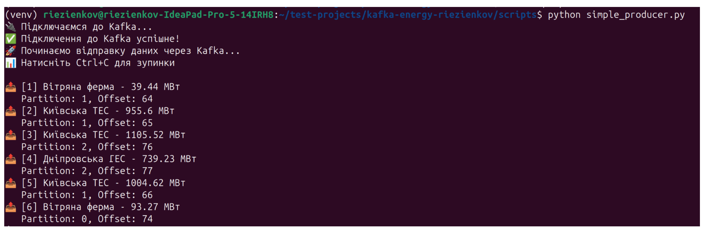
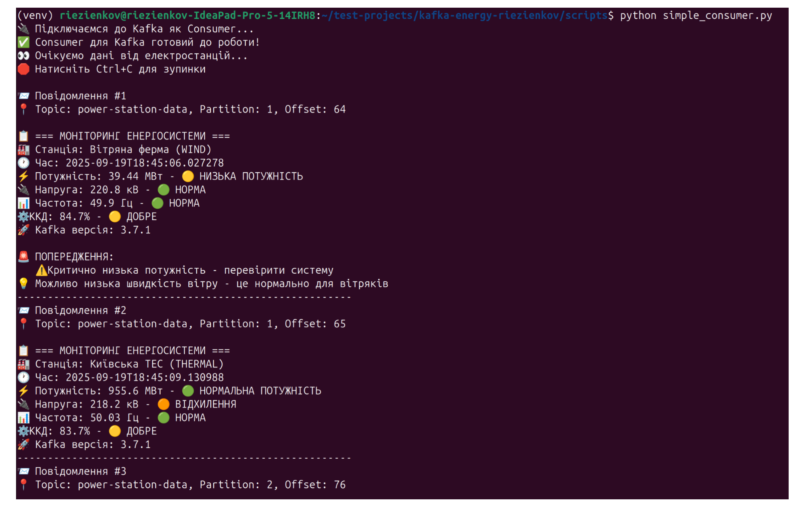

# Практична робота №1  
**Дисципліна:** Проектування систем з розподіленими базами даних в енергетиці  
**Варіант:** 12  

## Виконавець
- **Студент:** Рєзєнков Дмитро Анатолійович  
- **Група:** ТР-14  
- **Дата здачі:** 19.09.2025  
- **Викладач:** Волков О.В.  

---

## Тема роботи
**Основи роботи з Apache Kafka у розподілених базах даних**

---

## Мета роботи
- Ознайомитися з архітектурою **Apache Kafka** та її роллю в обробці потокових даних.  
- Навчитися створювати **топіки**, **продюсерів** і **консьюмерів**.  
- Відпрацювати передачу повідомлень у розподіленому середовищі.  
- Навчитися створювати прості приклади роботи з Kafka.  

---

## Зміст роботи
1. Запуск Apache Kafka.  
2. Створення топіка.  
3. Реалізація **продюсера** для відправки повідомлень.  
4. Реалізація **консьюмера** для прийому повідомлень.  
5. Демонстрація обміну даними.  

---

## Результати

---

## Репозиторій
🔗 [GitHub: KPI-Kafka](https://github.com/RezenkovD/KPI-Kafka)

---

## Висновки
У ході роботи було досліджено базові принципи роботи Apache Kafka.  
Студент навчився створювати топіки, продюсерів та консьюмерів, а також перевірив процес обміну повідомленнями у розподіленому середовищі.
